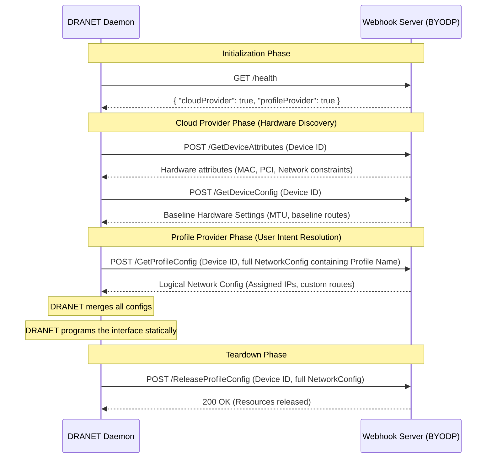

## Bring Your Own DRANET Provider (BYODP)

DRANET supports a flexible webhook architecture that allows users to supply custom implementations for both hardware discovery (Cloud Provider) and user intent (Profile Provider).

Instead of hardcoding bare-metal or CNI logic directly into DRANET, you can delegate these responsibilities to an external HTTP REST server. 

### Enabling Webhook Providers

To enable the webhook provider, update the `dranet` daemonset arguments:

* **`--cloud-provider-hint=webhook`**: Instructs DRANET to delegate physical/infrastructural truth (e.g., base MTU, hardware MAC, VPC Subnet IP) to the webhook.
* **`--profile-provider=webhook`**: Instructs DRANET to delegate logical network assignments and IPAM (e.g., specific IP addresses or overlays) to the webhook.
* **`--webhook-url=<url>`**: The HTTP URL of your webhook server. It supports standard HTTP/HTTPS URLs (e.g., `http://127.0.0.1:8080`) as well as Unix domain sockets (e.g., `unix:///var/run/dranet/webhook.sock`).

You can mix and match providers. For example, you can use the native GCP cloud provider for hardware discovery, but use a webhook for custom IPAM.

### Architecture Pipeline

The following diagram illustrates how DRANET communicates with the webhook providers during device discovery and profile resolution:




### How it Works in Practice

**1. Profile Providers (User Intent)**
Profile providers are options that third-party providers can expose to users to pick. The `profile` string in the DRANET configuration acts as a reference. It is suggested to follow a format that can be easily extended and clearly identified, such as `domain/name` (e.g. `acme.com/overlay`), or one with a clear meaning. In the `webhook-whereabouts` example, the `profile` string directly maps to the name of the underlying CNI configuration file.

**2. Cloud Providers (Cluster Provider Intent)**
Cloud providers are the authoritative source for the VM and its hardware, which is usually exposed via instance metadata. We offer two hooks for cloud providers: one to enhance the existing hardware metadata during discovery, and another to automate the provisioning of baseline hardware configurations. This represents the "cluster provider intent."

**3. Solid and Predictable Runtime Abstraction**
Regardless of which providers are in use, we always keep the same abstraction on the runtime for DRANET: a network interface and its associated network parameters (like IPs, routes, and rules). All of these external hooks work together to merge into a final, statically verifiable configuration for these interfaces *before* execution. This makes the DRANET runtime solid and predictable, in contrast with the dynamic behavior of standard CNI plugins that stop the world during runtime.

### Webhook Capabilities Validation

To ensure safe delegation, DRANET requires the webhook server to declare its capabilities via the `/health` endpoint.

When DRANET connects to the webhook, it performs an HTTP `GET /health` and expects a JSON payload defining the supported capabilities:

```json
{
  "cloudProvider": false,
  "profileProvider": true
}
```

If you start DRANET with `--cloud-provider-hint=webhook` but the webhook returns `"cloudProvider": false`, DRANET will log a fatal error during initialization to prevent misconfiguration.

### API Contracts

Your webhook server should implement the following HTTP `POST` endpoints based on the capabilities it provides. DRANET sends JSON payloads corresponding to its internal models.

#### Cloud Provider API (`cloudProvider: true`)

* `POST /GetDeviceAttributes`: Returns the physical hardware attributes for a device.
* `POST /GetDeviceConfig`: Returns the baseline physical network settings (like MTU).

#### Profile Provider API (`profileProvider: true`)

* `POST /GetProfileConfig`: Allocates and returns the logical profile configuration (e.g., allocating an IP address from IPAM). 

  **Mutation & Validation**: The webhook receives the *entire* `NetworkConfig` (combined from user and cloud intents) as context. Unlike standard Mutating Webhooks on the API server, this node-level webhook cannot directly mutate the opaque config object in the API server. Instead, it computes and returns the *resolved profile parameters* (like the chosen IP), which DRANET then merges into the final configuration. Passing the full configuration gives the webhook the power of a Validating Admission Controller.

  **Denying Configurations**: The webhook can deny a configuration if the user's intent is invalid or conflicts with its rules. It communicates this by returning an appropriate HTTP error code. When a webhook returns a non-200 status code, DRANET aborts the network setup during the `NodePrepareResources` phase (before the pod sandbox is even created).

  **Handling Errors & HTTP Codes**:
  * **200 OK**: Request successful. Returns the allocated logical configuration.
  * **400 Bad Request**: The provided `NetworkConfig` is malformed or requests invalid parameters (e.g., requesting an IP outside the allowed subnet). The `NodePrepareResources` call will fail.
  * **404 Not Found**: The requested profile does not exist in the webhook provider.
  * **409 Conflict**: The request conflicts with current state (e.g., the statically requested IP is already in use).
  * **500 Internal Server Error**: The webhook failed to allocate resources. DRANET treats this as a temporary failure, and the kubelet will typically retry the `NodePrepareResources` call.
  * **Network Failures**: If DRANET cannot reach the webhook due to a network timeout or connection refused, it also fails the `NodePrepareResources` call, and kubelet will continually retry.

  **Trade-offs & Downsides (Node-level vs. API-level Validation)**:
  Because this validation happens at the *node level* during DRA `NodePrepareResources` (rather than at the API server via standard Admission Webhooks), there are important trade-offs to consider:
  * **Late Feedback**: If a configuration is invalid, the API server will still accept the Pod. The failure happens asynchronously when the pod is scheduled and the kubelet attempts to prepare resources. Users won't see an immediate error on `kubectl apply`; the pod will remain in a `Pending` state, and they must inspect Pod events to see the `NodePrepareResources` failure.
  * **Kubelet Retry Loops**: Standard Kubernetes behavior is to retry failed resource preparations. A persistent denial (like a 400 Bad Request) will cause the Kubelet to continuously retry `NodePrepareResources`, which can generate unnecessary load on the node and webhook server compared to an upfront API rejection.
  * **Idempotency**: The kubelet may retry `NodePrepareResources`, so DRANET can call this more than once for the same `(device, claimUID)`. It must return an equivalent result without allocating additional resources (e.g. key the allocation by `claimUID`, as `whereabouts` does via `CNI_CONTAINERID`).

* `POST /ReleaseProfileConfig`: Frees stateful resources (e.g., releasing an IP address). Also receives the full `NetworkConfig`. Should return `200 OK` on success or if the resource was already released (idempotency).
  * **Best-effort teardown**: A failed `ReleaseProfileConfig` is logged but not retried by DRANET (teardown must not block pod deletion). The provider therefore owns leak reclamation and must be able to garbage-collect orphaned allocations on its own, otherwise resources leak permanently.

### Reference Implementation

An example implementation of a webhook profile provider that wraps the standard CNI `whereabouts` IPAM plugin is available at `cmd/webhook-whereabouts`. It acts as an independent module.

You can run this reference webhook locally:
```bash
cd cmd/webhook-whereabouts
go build .
./webhook-whereabouts --bind-address=127.0.0.1:8080
```
